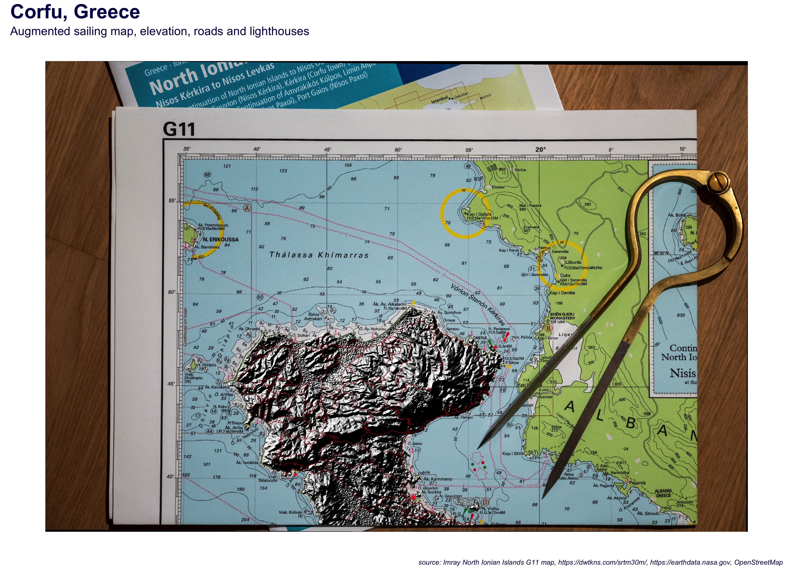

# Cartography
## Mini project part of a course project for Applied Data Science: Communication and Visualization for @epf_exts
 
I had to cancel my sailing trip to Corfu - Minor annoyance, minor in the context of a global pandemic disrupting many lives. So for this project, I chose to augment part of the sailing map I was supposed to be using with some additional features such as lighthouses, roads and relief shading. 

This entire exercise would not only allow me to project features on maps, but also allow me to project myself into this map... The idea of mixing a "real" picture with relief data came a tweet of Tyler Morgan Wall showing an old map of India.

<https://twitter.com/tylermorganwall/status/1281950095756402689?lang=en>

I started by taking a picture: 

In order to use it, I had to add some georeference data to the picture I followed the following tutotrial using the QGIS application:

<https://www.qgistutorials.com/en/docs/georeferencing_basics.html>

The code can certainly be improved but the result is what I wanted!

