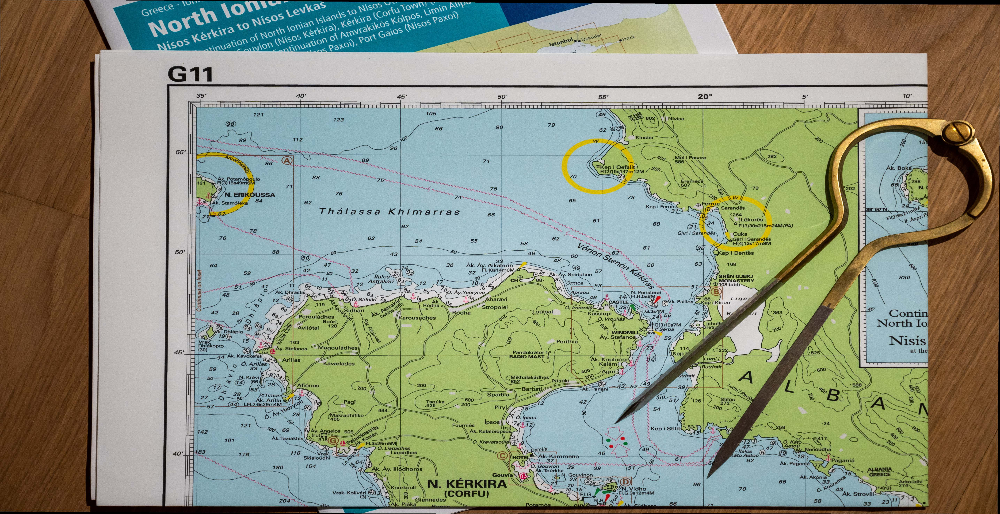

```{r setup, include=FALSE}
knitr::opts_chunk$set(echo = TRUE)
```

## Library loading

```{r loading, include=TRUE, message=FALSE, warning=FALSE}
library(tidyverse)
library(sf)
library(ggtext)
library(sp)
library(raster)
library(patchwork)
library(extrafont)
library(osmdata)
library(rosm)


```

# Cartography
## Mini project part of a course project for Applied Data Science: Communication and Visualization for @epf_exts
 
I had to cancel my sailing trip to Corfu - Minor annoyance, minor in the context of a global pandemic disrupting many lives. So for this project, I chose to augment part of the sailing map I was supposed to be using with some additional features such as lighthouses, roads and relief shading. 

This entire exercise would not only allow me to project features on maps, but also allow me to project myself into this map... The idea of mixing a "real" picture with relief data came a tweet of Tyler Morgan Wall showing an old map of India.

<https://twitter.com/tylermorganwall/status/1281950095756402689?lang=en>

I started by taking a picture: 




In order to use it, I had to add some georeference data to the picture I followed the following tutotrial using the QGIS application:

<https://www.qgistutorials.com/en/docs/georeferencing_basics.html>

The code can certainly be improved but the result is what I wanted!


```{r corfu, include=TRUE, message=FALSE, warning=FALSE}

corfu_map = raster::stack("data/corfu_wood.tif")

# we extract the bounding value from the georeferenced file

 bbx1<-extract_bbox(corfu_map)

#we reduce it's size as the shapefile and elevation data includes
#some part of mainland Greece
min_lon<-19.620209
max_lon<-19.967651

min_lat<-39.6248
max_lat<-39.832796

min_lon->bbx1[1,1]
max_lon->bbx1[1,2]

min_lat->bbx1[2,1]
max_lat->bbx1[2,2]

# we create the bbx tibble and polygon which we will use for cropping

bbx_tb1<-tibble(
  x=c(min_lon,min_lon,max_lon,max_lon),
  y=c(max_lat,min_lat,min_lat,max_lat)
)


bbx_polygon1<-bbx_tb1 %>%
  st_as_sf(coords = c("x", "y"), crs = 4326)%>%
  summarise(geometry = st_combine(geometry)) %>%
  st_cast("POLYGON")


#we load the shapefile and transform it to the desired projection
# and crop it

corfu_shp<-st_read("data/periphereies/periphereies.shp")
corfu_shp_wsg<- corfu_shp %>%
  st_transform(crs=4326)

cropped_corfu<-st_crop(corfu_shp_wsg,bbx_polygon1)

# we do the same for the raster file
srtm_corfu <- raster("data/corfu_hill.tif")
cropped_srtm_corfu<-mask(srtm_corfu,bbx_polygon1)
cropped_srtm_corfu_spdf <- as(cropped_srtm_corfu, "SpatialPixelsDataFrame")
cropped_srtm_corfu_tb <- as_tibble(cropped_srtm_corfu_spdf)


  corfu_map_2 <- corfu_map%>%
    # hide relief outside of Corfu by masking with country borders
   mask(cropped_corfu, inverse=TRUE) %>%
    as("SpatialPixelsDataFrame") %>%
    as.data.frame() %>%
    mutate(hex=rgb(corfu_wood.1,corfu_wood.2,corfu_wood.3, maxColorValue = 255))


#we extract some features
  highways <- bbx1 %>%
    opq()%>%
    add_osm_feature(key = "highway",
                    value=c("motorway", "trunk",
                            "primary","secondary",
                            "tertiary","motorway_link",
                            "trunk_link","primary_link",
                            "secondary_link",
                            "tertiary_link")) %>%
    osmdata_sf() %>% 
    trim_osmdata(bbx_polygon1) 

  light<- bbx1 %>%
    opq() %>%
    add_osm_feature(key = "man_made" ,
                    value=c("lighthouse")) %>%
    osmdata_sf()%>% 
    trim_osmdata(bbx_polygon1) 

 corfu<- ggplot() +

    geom_raster(data = cropped_srtm_corfu_tb, aes(x = x, y = y, fill = corfu_hill))+
    scale_fill_gradient(low = "black", high = "white")+
    geom_raster(
      data = corfu_map_2,
      mapping = aes(
        x = x,
        y = y), fill=corfu_map_2$hex)+

    geom_sf(data=highways$osm_lines,
            colour="darkred",
            size = 0.3,
            alpha = 1)+
    geom_sf(data=light$osm_points,
            fill="red",
            colour="red",
            size = 1,
            alpha = 1)+
    theme_void()+
 
   labs(title="Corfu, Greece",
        subtitle="Augmented sailing map, elevation, roads and lighthouses",
        caption="source: Imray North Ionian Islands G11 map, https://dwtkns.com/srtm30m/, https://earthdata.nasa.gov, OpenStreetMap")+
   
   theme(
     plot.title = element_text(color = "#010057", size = 25, face = "bold"),
     plot.subtitle = element_text(color = "#010057", size = 15),
     plot.caption = element_text(color = "#010057", face = "italic"),
     legend.position = ""
 )


 corfu
 
 
```
